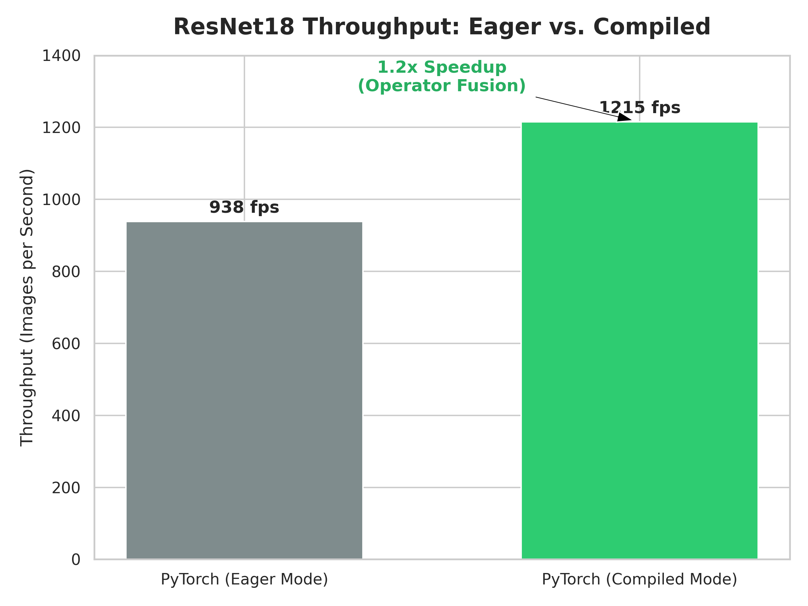
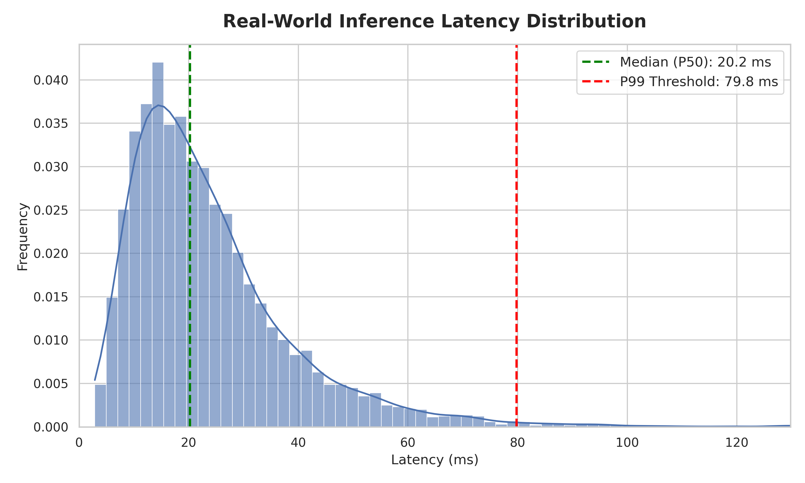

# Deep Learning Inference Benchmark 

A performance evaluation framework comparing runtime engines, optimization tiers, and numeric precision modes across distinct computer vision architectures on an **NVIDIA RTX 4050 Laptop GPU** (Ubuntu, Python 3.12).

📖 **[Read the full engineering breakdown and story on Medium here!](https://your-medium-link-here.com)**

Instead of model accuracy, this project focuses entirely on **production MLOps metrics**: throughput optimization, latency reduction, memory bandwidth constraints, and graph compilation layers.

---

##  Key Engineering Objectives
* **Isolate Optimization Vectors:** Measure performance deltas between standard PyTorch Eager execution, PyTorch Graph Compilation (`torch.compile`), and language-agnostic ONNX Runtime graphs.
* **Profile Hardware Bottlenecks:** Isolate latency penalties associated with host-to-device (CPU-to-GPU) data transfers across the physical PCIe bus.
* **Solve Environment Constraints:** Overcome real-world deployment challenges, including runtime dependency routing (`LD_LIBRARY_PATH`) and shared library loading failures (`libcudnn`).

---

##  Core Architectures Evaluated
The suite benchmarks three model topologies to assess how optimizations scale with model complexity:
1. **SmallCNN:** A lightweight custom architecture designed to isolate framework scheduling overhead from heavy compute.
2. **ResNet18:** A standard residual network with skip connections, serving as our industry baseline.
3. **MobileNetV2:** An inverted-residual, depthwise-separable network engineered for edge devices.

---

##  Empirical Benchmark Results
Aggregated execution metrics collected at a stable evaluation **Batch Size of 32**:

| Model Topology | Execution Engine / Framework | Hardware Target | Mean Batch Latency (ms) | Throughput (Samples/Sec) |
| :--- | :--- | :--- | :--- | :--- |
| **SmallCNN** | PyTorch Eager Mode | CUDA (RTX 4050) | ~14.40 | ~2,222.22 |
| **SmallCNN** | ONNX Runtime | CUDA (RTX 4050) | 14.55 | 2,197.97 |
| **SmallCNN** | ONNX Runtime | CPU | 14.68 | 2,179.07 |
| **ResNet18** | PyTorch Compiled (`max-autotune`) | CUDA (RTX 4050) | ~26.33 | **~1,215.34** |
| **ResNet18** | PyTorch Eager Mode | CUDA (RTX 4050) | ~34.10 | ~938.41 |
| **ResNet18** | ONNX Runtime | CUDA (RTX 4050) | 301.79 | 106.03 |
| **ResNet18** | ONNX Runtime | CPU (Fallback) | 343.79 | 93.08 |
| **MobileNetV2** | PyTorch Eager Mode | CUDA (RTX 4050) | ~42.50 | ~752.94 |
| **MobileNetV2** | ONNX Runtime | CUDA (RTX 4050) | 95.56 | 334.85 |
| **MobileNetV2** | ONNX Runtime | CPU | 96.62 | 331.17 |

<p align="center">
  
  
</p>

---

##  Core Technical Breakdowns

### 1. PyTorch Eager vs. `torch.compile`
* **The Problem:** Standard *Eager Mode* behaves step-by-step, calling back into the Python interpreter for every single layer, adding massive framework overhead.
* **The Fix:** Using `torch.compile(model, mode="max-autotune")` allows PyTorch to analyze the complete network layout and perform **Operator Fusion** (e.g., melting Conv + BatchNorm + ReLU into a single GPU instruction).
* **Takeaway:** Fusing operations rocketed ResNet18 throughput from **938 to 1,215 samples/sec** with zero hardware changes.

### 2. The ONNX Export Phase (Universal Blueprints)
* **The Goal:** Remove dependency on Python and PyTorch entirely. 
* **The Mechanism:** The live computational graph is traced using a dynamic tensor input and frozen into a language-agnostic `.onnx` file containing only the raw mathematical matrices. The resulting blueprint can run directly inside pure C++, Rust, or web browsers.

### 3. The ONNX Runtime Bottleneck (PCIe Overhead)
* **The Anomaly:** Raw ONNX Runtime underperformed heavily on ResNet18, plunging to **106 samples/sec**.
* **The Root Cause:** The engine was consuming standard NumPy arrays residing in host memory (CPU RAM). Every single inference request forced a execution sync, copying data across the physical motherboard **PCIe lanes** to device memory (GPU VRAM). The transit delay neutralized the GPU's raw processing speed.
* **The Production Fix:** Bypassed in enterprise apps by implementing **I/O Binding**, pre-allocating fixed memory pointers directly in GPU VRAM to ensure data remains resident on the device.

---

##  Precision Strategy: FP32 vs. FP16

* **Full Precision (FP32):** Allocates 32 bits per number. Vital for training because it maintains extreme numerical precision for smooth gradient updates, but slows down inference speed and bloats memory usage.
* **Half Precision (FP16):** Cuts memory allocation to 16 bits per number. This scales system memory bandwidth in half, doubles cache capacity, and directly activates physical **NVIDIA Tensor Cores** on the RTX 4050 for hardware-accelerated matrix math.

---

##  Environment Debugging Ledger

### Resolving Dynamic Linker/Loader Errors (`libcudnn`)
* **Symptom:** `Failed to load library libonnxruntime_providers_tensorrt.so with error: libcudnn.so.8: cannot open shared object file`
* **Resolution:** Isolated missing binaries within the Python virtual environment via wheel packages (`nvidia-cudnn-cu12`). Configured the shell environment to map library dependencies directly to those compiled engine objects:
  ```bash
  export LD_LIBRARY_PATH=$LD_LIBRARY_PATH:/home/aditya/.venvs/torch/lib/python3.12/site-packages/nvidia/cudnn/lib
